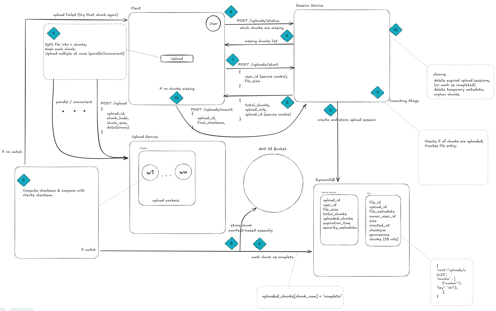
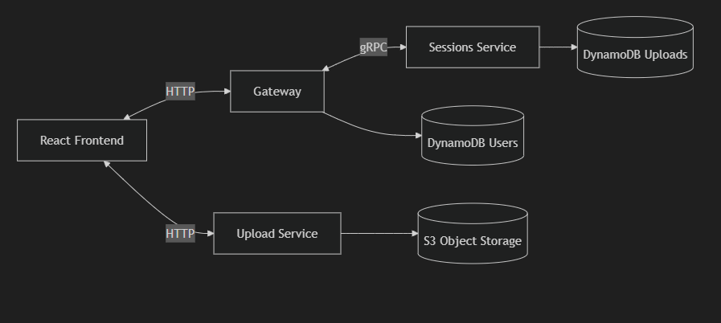
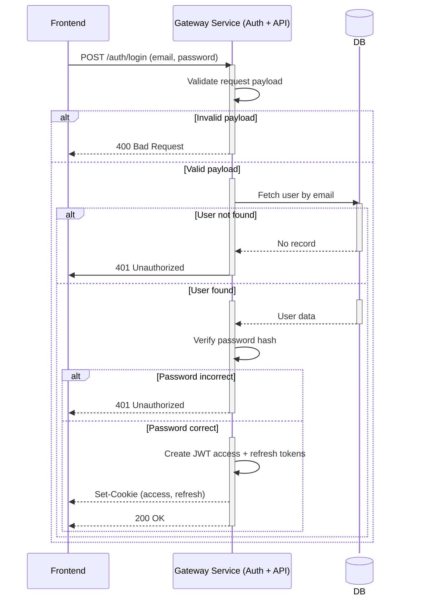
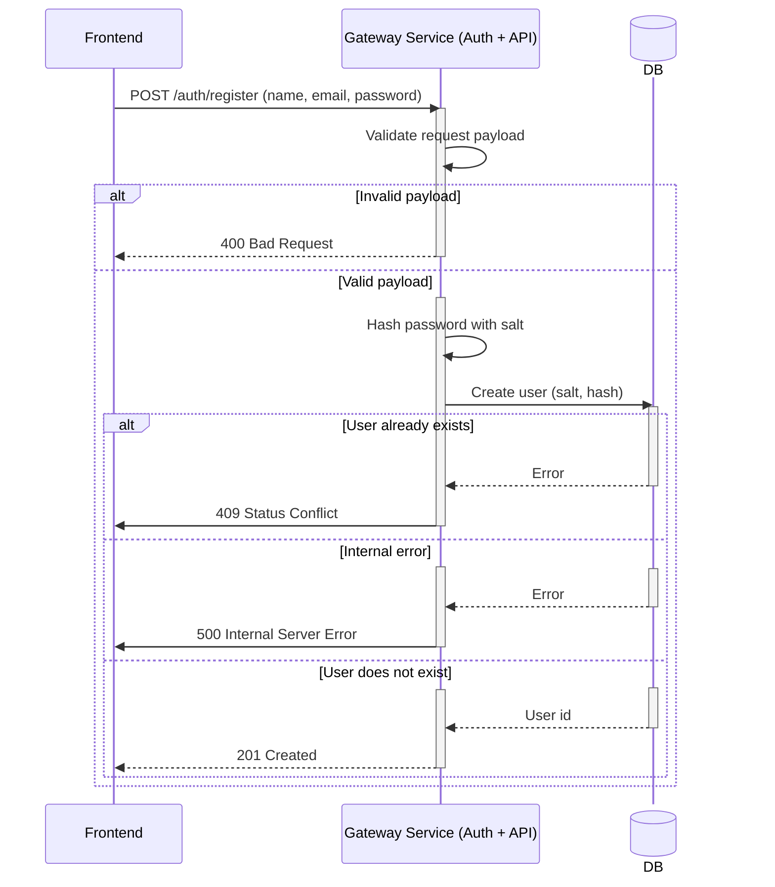
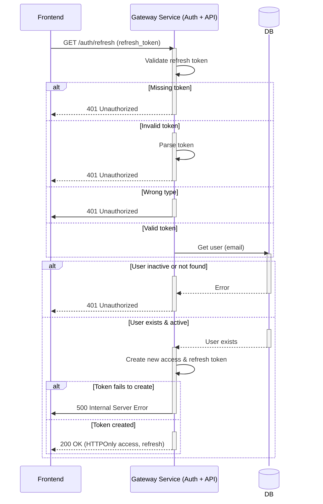
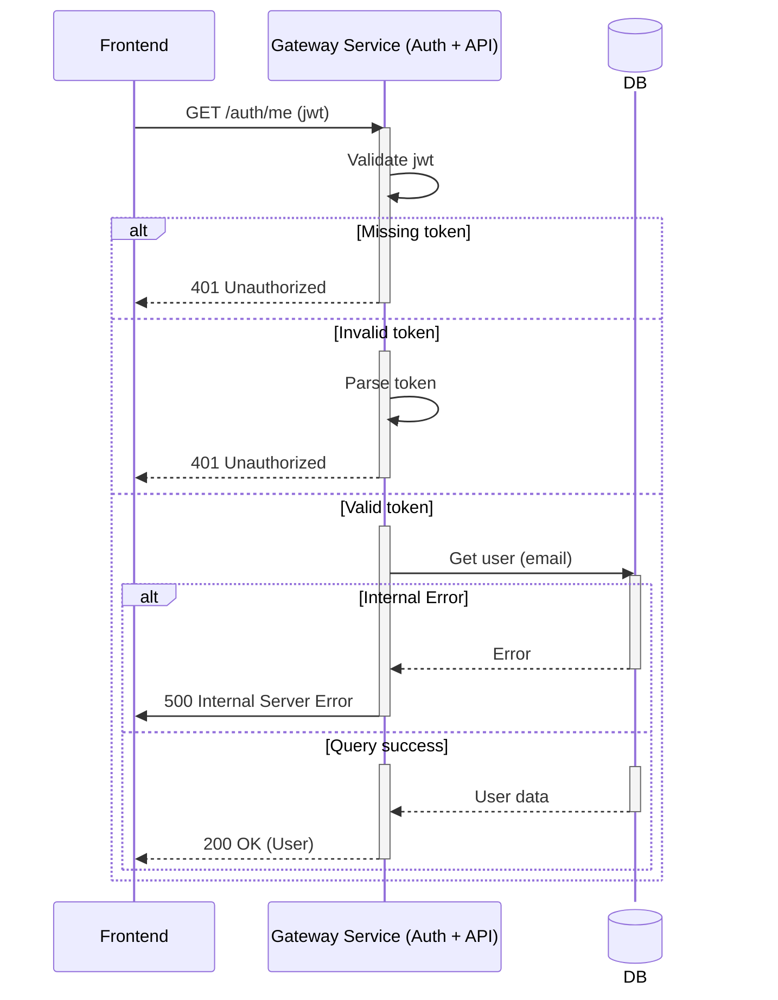

# System arhitecture
## Initial sketch

## Evolved Service Interactions Diagram

# Sequence Diagrams
Here are a few sequence diagrams that represent core auth and business logic.
## Login

## Register

## Refresh Token

## Me (User Profile)

