# System arhitecture
# Final AWS cloud architecture
## Network / infrastructure diagram
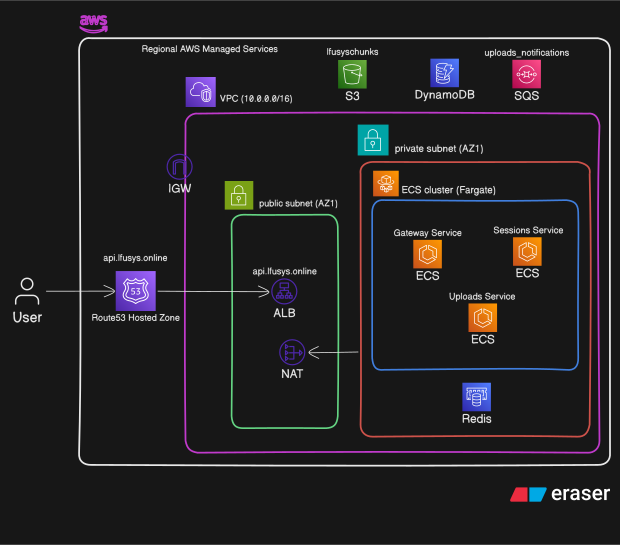
 Updated 2026/02/23

## Dependency View diagram

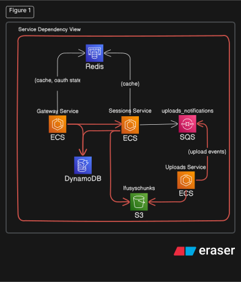
 Updated 2026/03/02

## Data Flow Diagram

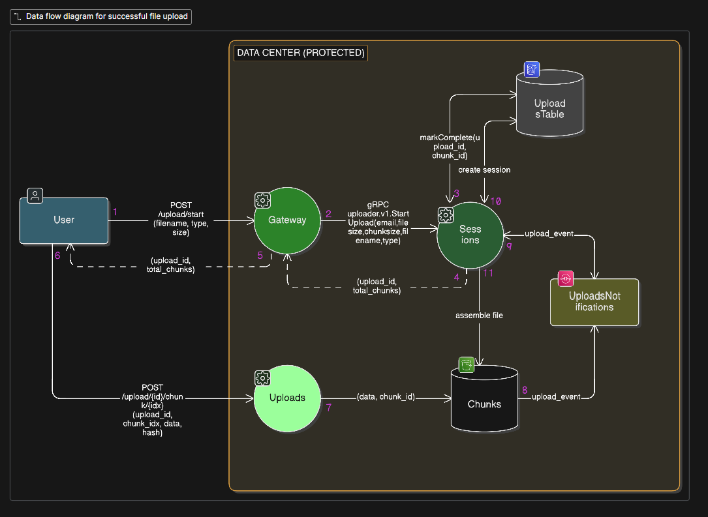
 Updated 2026/03/02

Scenario: Successful file upload

# Design Evolution
## Initial sketch
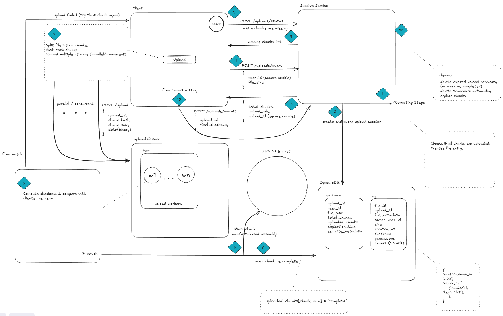

## Evolved sketch
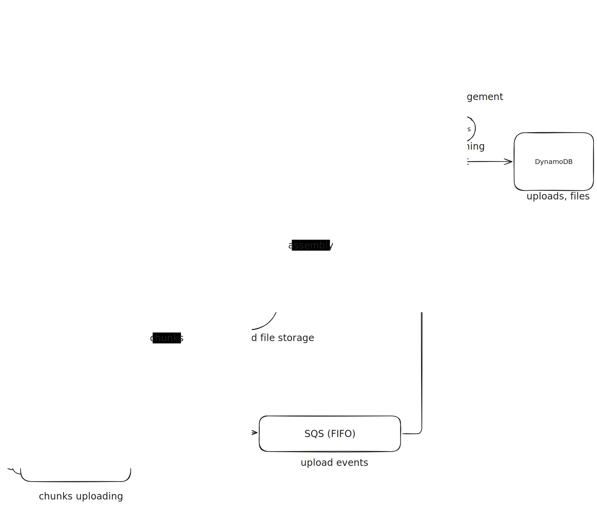

 Updated 2026/02/24

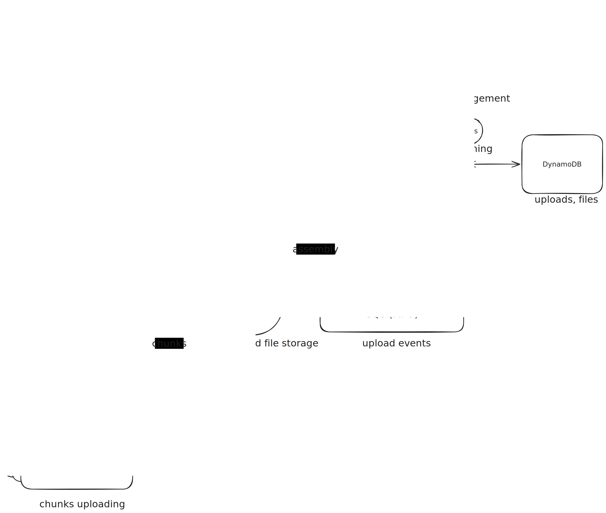

 Updated 2026/03/02

Changes: S3 directly emits upload events to SQS on upload completeness. This change makes system more resilient and prevents from lost upload events when Uploads Service crashes right after uploading to S3. Outbox pattern could not be used here, as we cannot atomically upload to S3 and write an event to the outbox database. So S3 here acts as a single source of truth.

## Evolved Service Interactions Diagram
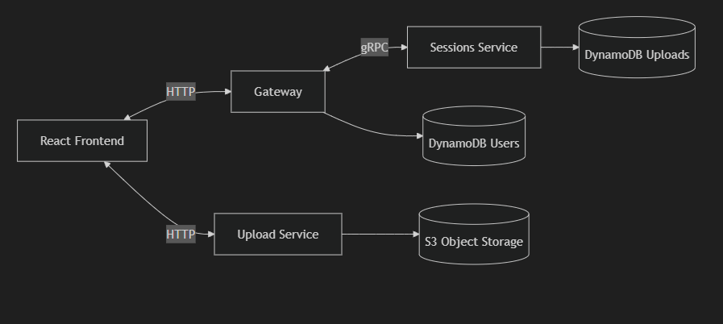

# Sequence Diagrams
Here are a few sequence diagrams that represent core auth and business logic.
## Login

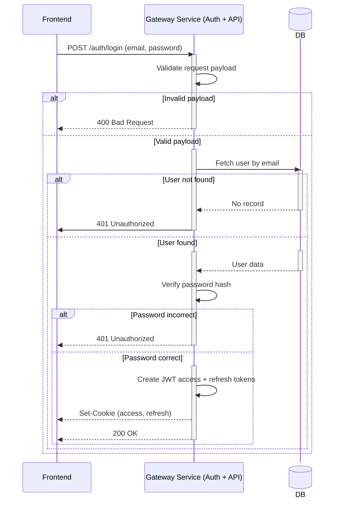
```mermaid

sequenceDiagram
    participant FE as Frontend
    participant GW as Gateway Service (Auth + API)
    participant DB@{"type":"database"}

    FE->>GW: POST /auth/login (email, password)
    activate GW

    GW->>GW: Validate request payload
    alt Invalid payload
        GW-->>FE: 400 Bad Request
        deactivate GW

    else Valid payload
        activate GW
        GW->>DB: Fetch user by email
        activate DB

        alt User not found
            DB-->>GW: No record
            deactivate DB
            GW->>FE: 401 Unauthorized
            deactivate GW

        else User found
            activate DB
            activate GW
            DB-->>GW: User data
            deactivate DB
            GW->>GW: Verify password hash

            alt Password incorrect
                GW-->>FE: 401 Unauthorized
                deactivate GW
            else Password correct
                activate GW
                GW->>GW: Create JWT access + refresh tokens
                GW-->>FE: Set-Cookie (access, refresh)
                GW-->>FE: 200 OK
                deactivate GW
            end
        end
    end

```

## Register

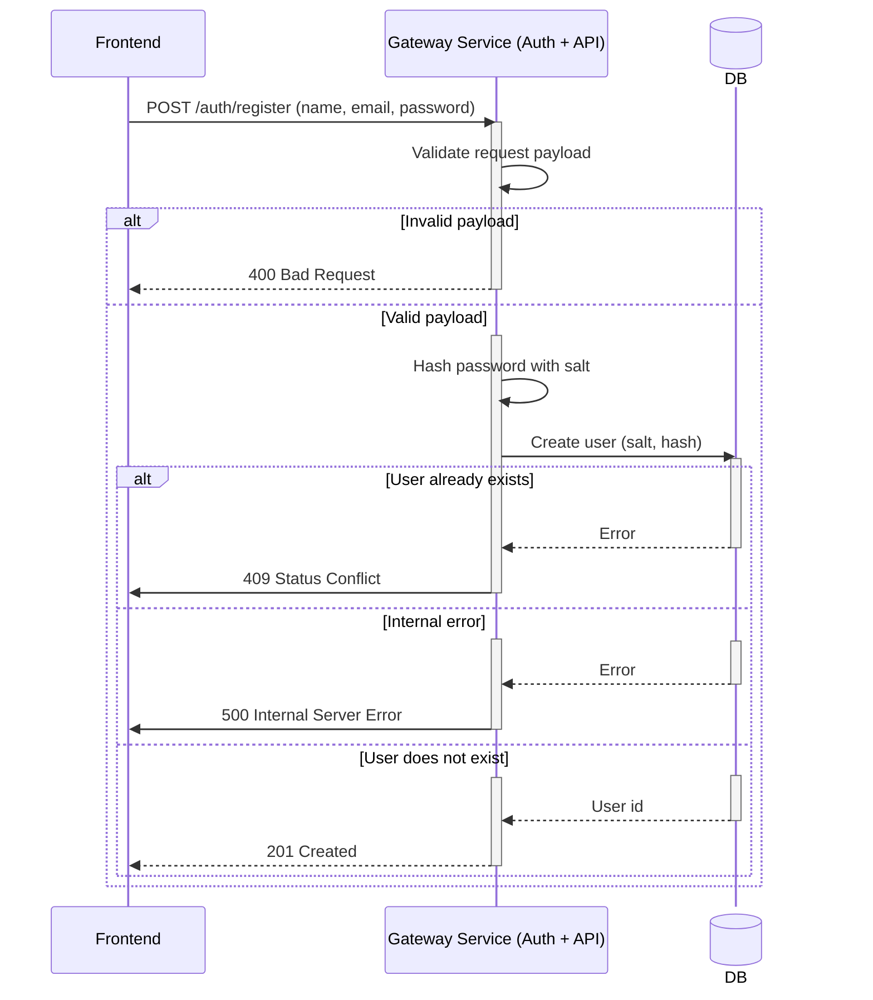
```mermaid

sequenceDiagram
    participant FE as Frontend
    participant GW as Gateway Service (Auth + API)
    participant DB@{"type":"database"}

    FE->>GW: POST /auth/register (name, email, password)
    activate GW

    GW->>GW: Validate request payload
    alt Invalid payload
        GW-->>FE: 400 Bad Request
        deactivate GW

    else Valid payload
        activate GW
        GW->>GW: Hash password with salt
        GW->>DB: Create user (salt, hash)
        activate DB

        alt User already exists
            DB-->>GW: Error
            deactivate DB
            GW->>FE: 409 Status Conflict
            deactivate GW

        else Internal error
            activate GW
            activate DB
            DB-->>GW: Error
            deactivate DB
            GW->>FE: 500 Internal Server Error
            deactivate GW

        else User does not exist
            activate DB
            activate GW
            DB-->>GW: User id
            deactivate DB
            GW-->>FE: 201 Created
            deactivate GW
        end
    end

```

## Refresh Token
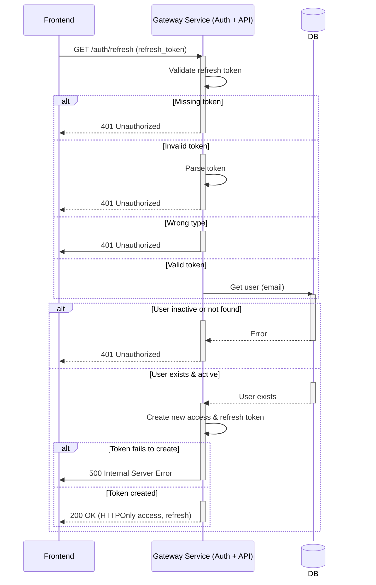
```mermaid

sequenceDiagram
    participant FE as Frontend
    participant GW as Gateway Service (Auth + API)
    participant DB@{"type":"database"}

    FE->>GW: GET /auth/refresh (refresh_token)
    activate GW

    GW->>GW: Validate refresh token
    alt Missing token
        GW-->>FE: 401 Unauthorized
        deactivate GW

    else Invalid token
        activate GW
        GW->>GW: Parse token
        GW-->>FE: 401 Unauthorized
        deactivate GW

    else Wrong type
        activate GW
        GW->>FE: 401 Unauthorized
        deactivate GW

    else Valid token
        GW->>DB: Get user (email)
        activate DB
    end

    alt User inactive or not found
        activate GW
        DB-->>GW: Error
        deactivate DB
        GW-->>FE: 401 Unauthorized
        deactivate GW

    else User exists & active
        activate DB
        DB-->>GW: User exists
        deactivate DB
        activate GW
        GW->>GW: Create new access & refresh token

        alt Token fails to create
            GW->>FE: 500 Internal Server Error
            deactivate GW

        else Token created
            activate GW
            GW-->>FE: 200 OK (HTTPOnly access, refresh)
            deactivate GW
        end

    end

```

## Me (User Profile)

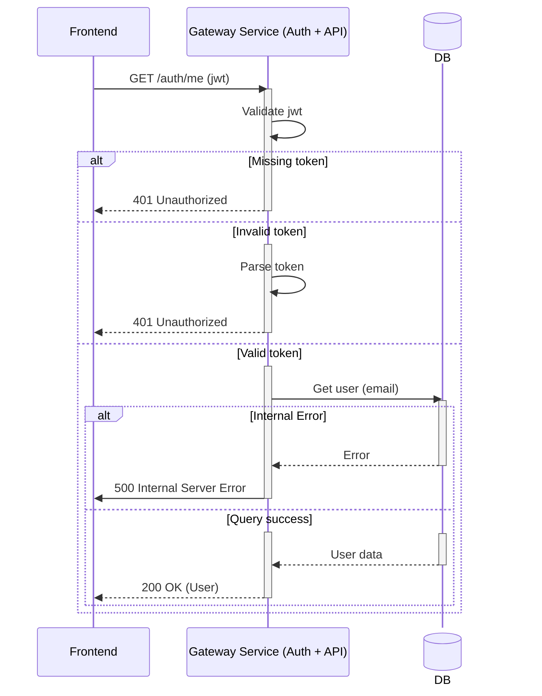
```mermaid

sequenceDiagram
    participant FE as Frontend
    participant GW as Gateway Service (Auth + API)
    participant DB@{"type":"database"}

    FE->>GW: GET /auth/me (jwt)
    activate GW

    GW->>GW: Validate jwt
    alt Missing token
        GW-->>FE: 401 Unauthorized
        deactivate GW

    else Invalid token
        activate GW

        GW->>GW: Parse token
        GW-->>FE: 401 Unauthorized
        deactivate GW

    else Valid token
        activate GW
        GW->>DB: Get user (email)
        activate DB

        alt Internal Error
            DB-->>GW: Error
            deactivate DB
            GW->>FE: 500 Internal Server Error
            deactivate GW

        else Query success
            activate GW
            activate DB
            DB-->>GW: User data
            deactivate DB
            GW-->>FE: 200 OK (User)
            deactivate GW
        end
    end

```