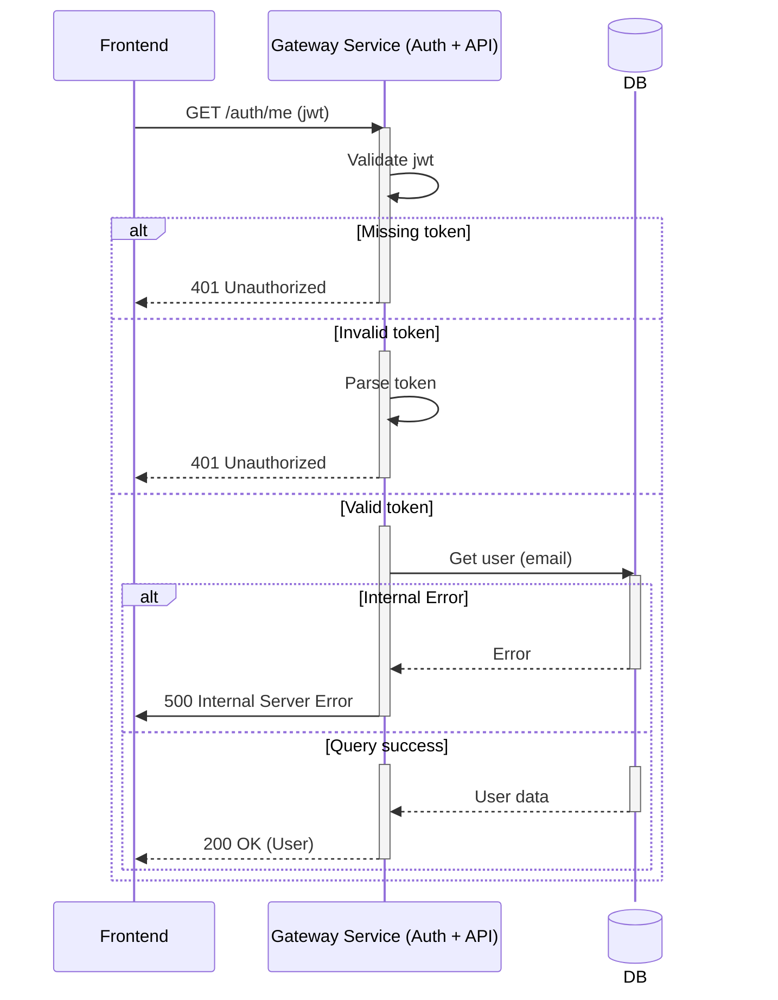

```mermaid

sequenceDiagram
    participant FE as Frontend
    participant GW as Gateway Service (Auth + API)
    participant DB@{"type":"database"}

    FE->>GW: GET /auth/me (jwt)
    activate GW

    GW->>GW: Validate jwt
    alt Missing token
        GW-->>FE: 401 Unauthorized
        deactivate GW

    else Invalid token
        activate GW

        GW->>GW: Parse token
        GW-->>FE: 401 Unauthorized
        deactivate GW

    else Valid token
        activate GW
        GW->>DB: Get user (email)
        activate DB

        alt Internal Error
            DB-->>GW: Error
            deactivate DB
            GW->>FE: 500 Internal Server Error
            deactivate GW

        else Query success
            activate GW
            activate DB
            DB-->>GW: User data
            deactivate DB
            GW-->>FE: 200 OK (User)
            deactivate GW
        end
    end

```