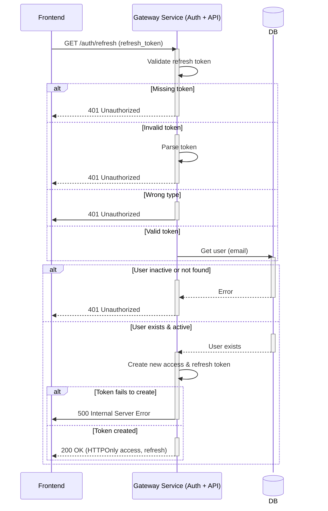

```mermaid

sequenceDiagram
    participant FE as Frontend
    participant GW as Gateway Service (Auth + API)
    participant DB@{"type":"database"}

    FE->>GW: GET /auth/refresh (refresh_token)
    activate GW

    GW->>GW: Validate refresh token
    alt Missing token
        GW-->>FE: 401 Unauthorized
        deactivate GW

    else Invalid token
        activate GW
        GW->>GW: Parse token
        GW-->>FE: 401 Unauthorized
        deactivate GW

    else Wrong type
        activate GW
        GW->>FE: 401 Unauthorized
        deactivate GW

    else Valid token
        GW->>DB: Get user (email)
        activate DB
    end

    alt User inactive or not found
        activate GW
        DB-->>GW: Error
        deactivate DB
        GW-->>FE: 401 Unauthorized
        deactivate GW

    else User exists & active
        activate DB
        DB-->>GW: User exists
        deactivate DB
        activate GW
        GW->>GW: Create new access & refresh token

        alt Token fails to create
            GW->>FE: 500 Internal Server Error
            deactivate GW

        else Token created
            activate GW
            GW-->>FE: 200 OK (HTTPOnly access, refresh)
            deactivate GW
        end

    end

```