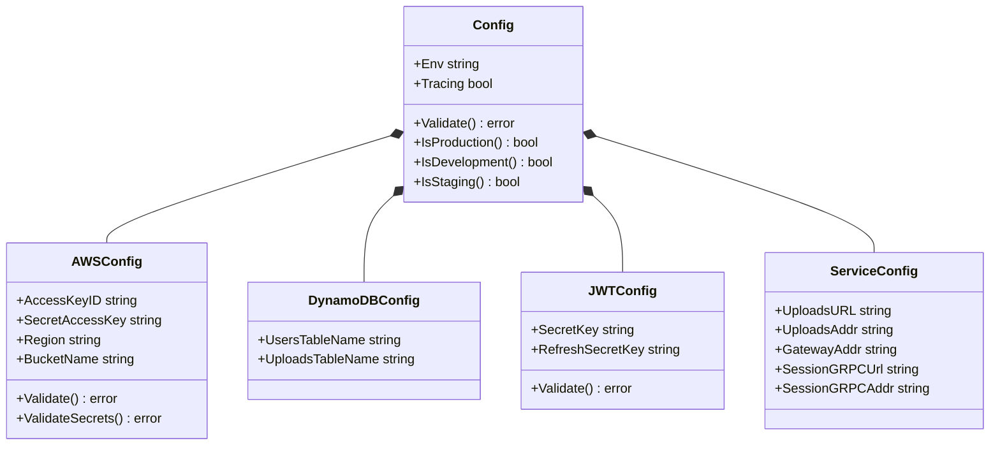

```mermaid
classDiagram
direction TB

    class AWSConfig{
        +AccessKeyID string
        +SecretAccessKey string
        +Region string
        +BucketName string
        +Validate() error
        +ValidateSecrets() error
    }

    class ServiceConfig{
        +UploadsURL string
        +UploadsAddr string
        +GatewayAddr string
        +SessionGRPCUrl string
        +SessionGRPCAddr string
    }

    class DynamoDBConfig{
        +UsersTableName string
        +UploadsTableName string
    }

    class JWTConfig{
        +SecretKey string
        +RefreshSecretKey string
        +Validate() error
    }

    class Config {
        +Env string
        +Tracing bool
        +Validate() error
        +IsProduction() bool
        +IsDevelopment() bool
        +IsStaging() bool
    }

    Config *-- AWSConfig
    Config *-- DynamoDBConfig
    Config *-- JWTConfig
    Config *-- ServiceConfig
```