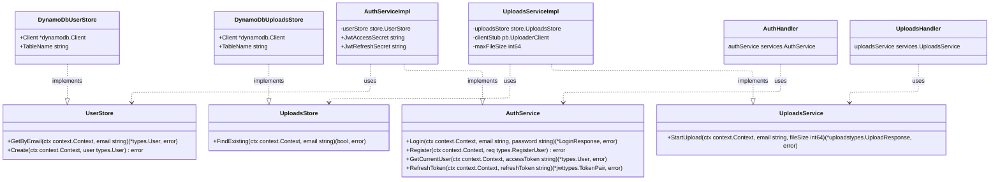

```mermaid
---
config:
  layout: elk
---
classDiagram
direction TD
    class UserStore{
        +GetByEmail(ctx context.Context, email string) (*types.User, error)
	    +Create(ctx context.Context, user types.User) error
    }

    class UploadsStore{
        +FindExisting(ctx context.Context, email string) (bool, error)
    }
    class AuthService {
        +Login(ctx context.Context, email string, password string) (*LoginResponse, error)
	    +Register(ctx context.Context, req types.RegisterUser) error
	    +GetCurrentUser(ctx context.Context, accessToken string) (*types.User, error)
	    +RefreshToken(ctx context.Context, refreshToken string) (*jwttypes.TokenPair, error)
    }

    class UploadsService {
        +StartUpload(ctx context.Context, email string, fileSize int64) (*uploadstypes.UploadResponse, error)
    }
    class DynamoDbUserStore{
        +Client    *dynamodb.Client
	    +TableName string
    }

    class DynamoDbUploadsStore{
        +Client    *dynamodb.Client
	    +TableName string
    }
    class AuthServiceImpl {
        -userStore        store.UserStore
	    +JwtAccessSecret  string
	    +JwtRefreshSecret string
    }

    class UploadsServiceImpl {
        -uploadsStore store.UploadsStore
	    -clientStub   pb.UploaderClient
	    -maxFileSize  int64
    }
    class AuthHandler{
        authService services.AuthService
    }

    class UploadsHandler{
        uploadsService services.UploadsService
    }


    DynamoDbUserStore ..|> UserStore : implements
    DynamoDbUploadsStore ..|> UploadsStore : implements

    AuthServiceImpl ..|> AuthService : implements
    AuthServiceImpl ..> UserStore : uses
    UploadsServiceImpl ..|> UploadsService : implements
    UploadsServiceImpl ..> UploadsStore : uses

    AuthHandler ..> AuthService : uses
    UploadsHandler ..> UploadsService : uses
```