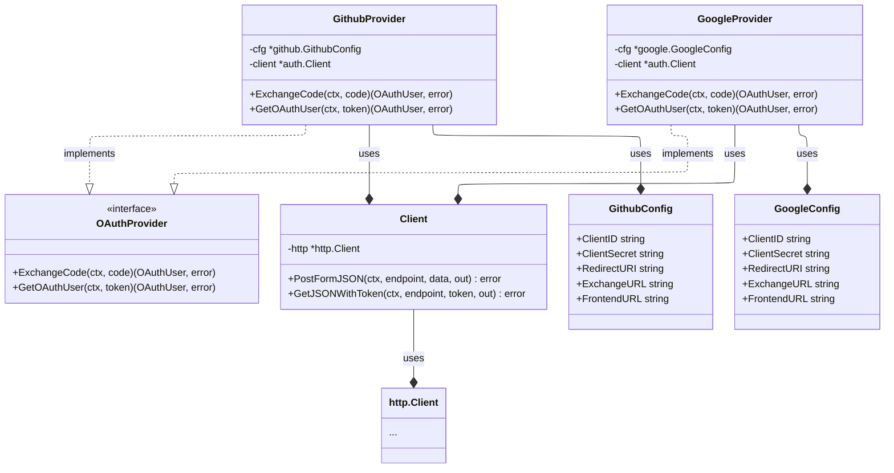

```mermaid
---
config:
  layout: elk
---
classDiagram
        class OAuthProvider{
            <<interface>>
            +ExchangeCode(ctx, code) (OAuthUser, error)
            +GetOAuthUser(ctx, token) (OAuthUser, error)
        }

        class GithubProvider{
            -cfg    *github.GithubConfig
	        -client *auth.Client
            +ExchangeCode(ctx, code) (OAuthUser, error)
            +GetOAuthUser(ctx, token) (OAuthUser, error)
        }

        class GoogleProvider{
            -cfg    *google.GoogleConfig
	        -client *auth.Client
            +ExchangeCode(ctx, code) (OAuthUser, error)
            +GetOAuthUser(ctx, token) (OAuthUser, error)
        }

        class Client {
            -http *http.Client
            +PostFormJSON(ctx, endpoint, data, out) error
            +GetJSONWithToken(ctx, endpoint, token, out) error
        }

        class http.Client{
            ...
        }
        class GithubConfig {
            +ClientID     string
            +ClientSecret string
            +RedirectURI  string
            +ExchangeURL  string
            +FrontendURL  string
        }

        class GoogleConfig {
            +ClientID     string
            +ClientSecret string
            +RedirectURI  string
            +ExchangeURL  string
            +FrontendURL  string
        }


        GithubProvider ..|> OAuthProvider: implements
        GoogleProvider ..|> OAuthProvider: implements

        Client --* http.Client: uses
        GithubProvider --* Client: uses
        GoogleProvider --* Client: uses

        GithubProvider --* GithubConfig: uses
        GoogleProvider --* GoogleConfig: uses

```